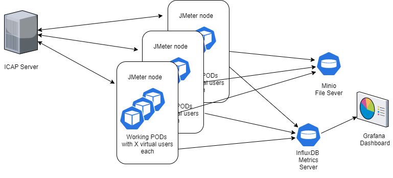

# 100k traffic generation

## The system overview

The traffic to the ICAP server is generated by working PODs running on dedicated JMeter nodes within a Kubernetes cluster. Along with the working Nodes/Pods, the cluster setup includes a Minio File Server, an InfluxDB Metrics Server, and a Grafana server with the corresponding dashboard(s).



Each of the pods runs an instance of JMeter with X number of threads where each of the threads emulates the specified ICAP server user. So, "users" get files from the Minio file server, send those to the ICAP server to be processed/rebuild and then upload the rebuilt files back to the Minio file server. The metrics of the operations are gathered by JMeter and uploaded to InfluxDB. Grafana gets those metrics from InfluxDB and visualizes those in the dashboard.
Also, JMeter logs generated on the PODs are uploaded to the Minio server for further analysis.

## 1. Prerequisites

- An Azure AKS or Amazon EKS cluster  that can autoscale to have a sufficient number of nodes to run the test.

## 2. Provision a cluster

For Azure AKS - ["Provision an AKS Cluster"](deployment/terraform/aks/README.MD)<br/>
For AWS EKS see ["Provision an EKS Cluster"](deployment/terraform/eks/README.md)

## 3. Setting up the common resources
Create Minio, Influxdb, and Grafana services in the cluster.<br/>
Follow the instructions at ["Deploy applications to K8s cluster"](deployment/kubernetes/common_resources/README.md)

### 3.1 Influx JMeter Database
The cluster InfluxDB deployment must have a database called JMeter.<br/>
To create it enter the bash shell of the Influx DB pod
```
    kubectl exec -it <influxdb pod> -- bash
```
Then create the DB with the following commands
```
    # influx
    > database create jmeter
    > exit
    # exit
```
## 4. Using create_stack_dash.py to Create Load Generators and Corresponding Dashboards
For detailed instructions see the following [README](jmeter-icap/scripts/README.md)
