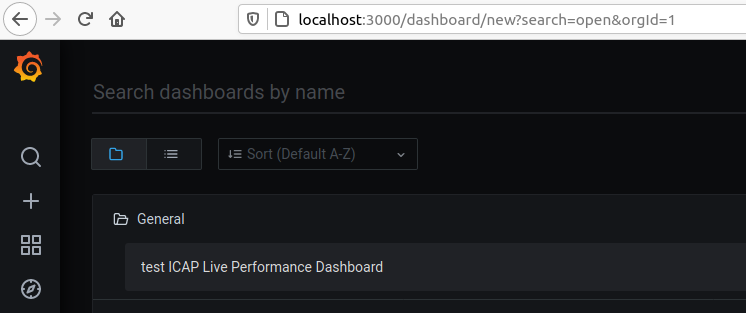

# Introduction
OVA image encapsulates the JMeter engine test environment within a single virtual machine<br/>
<br/>
The environment does not have to scale up capabilities (like in EKS or AKS). However, it allows us to demonstrate the whole workflow along with results visualization in a Grafana dashboard.
# Test engine deployment with the OVA file
1. Get the latest OVA image from Glasswall AWS S3 icap-performance-test-data-bucket bucket<br/>
<br/>
2. 
    - When deploying on a VMware ESXi host, create a new VM (In Virtual Machines click on 'Create / Register VM') and choose 'Deploy a virtual machine from an OVF or OVA file'. Follow the deployment wizard instructions.
    - When deploying on a VMware Workstation in select 'File/Open' menu and navigate to the OVA file location on the computer<br/>
3. Once the VM starts login with user `glasswall` and password `Gl@sswall`<br/>
4. Make sure the VM can access the network. <br\>
The VM has a preset static IP address to run on Glasswall VMware ESXi host.<br/>
<br/>
Depending on your network configuration, change to automatic IP (must have DHCP server accessible)<br/>
<br/>
or set static IP by following the [instructions](https://www.howtoforge.com/linux-basics-set-a-static-ip-on-ubuntu)<br/>
5. In a terminal window try listing the current pods with the following command:
```
    kubectl get pods --all-namespaces
```
The output should look like
```
    NAMESPACE     NAME                                         READY   STATUS                  RESTARTS   AGE
    common        loki-promtail-fm5j6                          1/1     Running                 14         37h
    common        promtail-5wkxz                               1/1     Running                 12         37h
    kube-system   metrics-server-8bbfb4bdb-f7mhl               1/1     Running                 38         8d
    kube-system   calico-node-wn6rf                            1/1     Running                 50         8d
    kube-system   calico-kube-controllers-847c8c99d-t5gr5      1/1     Running                 36         8d
    common        influxdb-0                                   1/1     Running                 28         7d13h
    common        grafana-568dfdfc94-lzfmf                     0/1     Init:ImagePullBackOff   0          21h
    kube-system   kubernetes-dashboard-7ffd448895-gzfrs        1/1     Running                 41         8d
    common        minio-774cb77ff5-r47b7                       1/1     Running                 30         7d13h
    kube-system   dashboard-metrics-scraper-6c4568dc68-4fzw6   1/1     Running                 41         8d
    kube-system   coredns-86f78bb79c-2pbz9                     0/1     Running                 40         8d
    common        loki-0                                       0/1     Running                 9          21h
    kube-system   tiller-deploy-69c484895f-sj4tv               0/1     Running                 29         7d14h
```
wait until all the PODs are `READY` and `Running`<br/>
6. In some case step 5 on the initially deployed VM might fail with the following error
```
    Unable to connect to the server: x509: certificate has expired or is not yet valid: current time 2020-05-03T23:53:06Z is after 2020-05-03T16:38:01Z
```
If this is the case run the command below
```
    sudo microk8s.refresh-cert
```
Wait until microk8s restarts and retry step 5<br/>
7. Open a new terminal tab and run the following:
```
    kubectl port-forward -n common service/minio-service 9000:80
```
In another terminal tab
```
    kubectl port-forward -n common service/grafana-service 3000:80
```
<br/>
8. Open the Mozilla browser and navigate to the following pages 
Minio http://localhost:9000
Grafana http://localhost:3000
The credentials for both are admin/admin@123<br/>
9. Open a new terminal tab and run the following:
```
cd ~/scripts
```
Here make sure the parameters passed to the master script are correct
```
    cat config.env
```
Here are the expected settings:
```
    AWS_PROFILE_NAME=default
    REGION=eu-west-1
    TOTAL_USERS=100
    USERS_PER_INSTANCE=25
    DURATION=300
    TEST_DATA_FILE=gov_uk_files.csv
    MINIO_URL=http://minio-service.common:80
    MINIO_ACCESS_KEY=admin
    MINIO_SECRET_KEY=admin@123
    MINIO_INPUT_BUCKET=icap-performance-test-data-bucket
    MINIO_OUTPUT_BUCKET=output
    INFLUXDB_URL=http://influxdb-service.common:80
    PREFIX=test
    ICAP_SERVER_URL=eu.icap.glasswall-icap.com
    GRAFANA_URL=localhost:3000
    GRAFANA_API_KEY=eyJrIjoiZE9FWGt5MDl6Qld4VlhzcHd3TzVyWGh3MUJZZzkyNmEiLCJuIjoiSk1ldGVyIHRlc3QiLCJpZCI6MX0=
    GRAFANA_FILE=../grafana_dashboards/k8-test-engine-dashboard.json
    EXCLUDE_DASHBOARD=0
    PRESERVE_STACK=0
    ICAP_SERVER_PORT=1344
    ENABLE_TLS=0
    TLS_VERIFICATION_METHOD=no-verify
```
Then run the master script
```
    sudo python3 create_stack_dash.py 
```
The output should look as follows:
```
    Creating Load Generators...
    INFO:create_stack:TOTAL USERS         100
    INFO:create_stack:USERS PER INSTANCE  25
    INFO:create_stack:TEST DURATION       300
    INFO:create_stack:FILE LIST           ../testdata/files01.csv
    INFO:create_stack:MINIO URL           http://minio-service.common:80
    INFO:create_stack:MINIO INPUT BUCKET  input
    INFO:create_stack:MINIO outPUT BUCKET output
    INFO:create_stack:INFLUXDB URL        http://influxdb-service.common:80
    INFO:create_stack:INFLUX HOST         influxdb-service.common
    INFO:create_stack:PREFIX              demo
    INFO:create_stack:ICAP SERVER         gw-icap02.westeurope.azurecontainer.io
    Client Version: version.Info{Major:"1", Minor:"19+", GitVersion:"v1.19.3-34+a56971609ff35a", GitCommit:"a56971609ff35ac8cc90b2aef89165208bff3fe1", GitTreeState:"clean", BuildDate:"2020-11-06T11:56:24Z", GoVersion:"go1.15.3", Compiler:"gc", Platform:"linux/amd64"}
    Server Version: version.Info{Major:"1", Minor:"19+", GitVersion:"v1.19.3-34+a56971609ff35a", GitCommit:"a56971609ff35ac8cc90b2aef89165208bff3fe1", GitTreeState:"clean", BuildDate:"2020-11-06T11:57:19Z", GoVersion:"go1.15.3", Compiler:"gc", Platform:"linux/amd64"}
    INFO:create_stack:Micro k8s           True
    No resources found
    secret/jmeterconf created
    secret/filesconf created
    INFO:create_stack:Number of pods to be created: 4
    job.batch/demo-jmeterjob created
    Creating dashboard...
    Dashboard created at: 
    http://localhost:3000/d/cfbjZi0Mz/demo-icap-live-performance-dashboard
    Stack will be deleted after 20.0 minutes
    0.0 minutes have elapsed, stack will be deleted in 20.0 minutes
```
<br/>
10. At the moment Grafana is supposed to have a newly created dashboard whose name starts with the `PREFIX` value in config.env passed to the master script. <br/>
<br/>
Open the dashboard and watch a visualization of the running test <br/>
<br/>