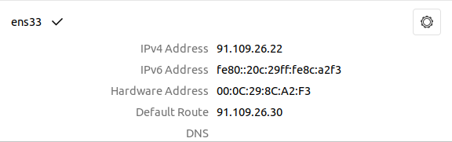
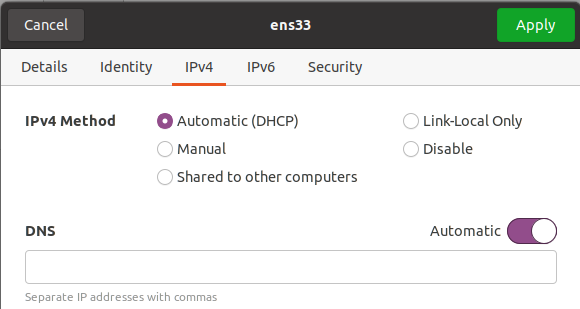

# Introduction
OVA image encapsulates the JMeter engine test environment within a single virtual machine<br/>
<br/>
The environment does not have to scale up capabilities (like in EKS or AKS). However, it allows us to demonstrate the whole workflow along with results visualization in a Grafana dashboard.
# Test engine deployment with OVA
1. Get the latest OVA image from Glasswall AWS S3 icap-performance-test-data-bucket bucket<br/>

2. 
    - When deploying on a VMware ESXi host, create a new VM (In Virtual Machines click on 'Create / Register VM') and choose 'Deploy a virtual machine from an OVF or OVA file'. Follow the deployment wizard instructions.
    
    - When deploying on a VMware Workstation in select 'File/Open' menu and navigate to the OVA file location on the computer<br/>
    
3. Once the VM starts login with user `glasswall`
4. Make sure the VM can access the network. <br/>
The VM has a preset static IP address to run on Glasswall VMware ESXi host.<br/>
<br/>
Depending on your network configuration, change to automatic IP (must have DHCP server accessible)<br/>
<br/>
or set static IP by following the [instructions](https://www.howtoforge.com/linux-basics-set-a-static-ip-on-ubuntu)
5. In a terminal window try listing the current pods with the following command:
```
    kubectl get pods --all-namespaces
```
The output should look like
```
    NAMESPACE     NAME                                         READY   STATUS
    common        loki-promtail-fm5j6                          1/1     Running
    common        promtail-5wkxz                               1/1     Running
    kube-system   metrics-server-8bbfb4bdb-f7mhl               1/1     Running
    kube-system   calico-node-wn6rf                            1/1     Running
    kube-system   calico-kube-controllers-847c8c99d-t5gr5      1/1     Running
    common        influxdb-0                                   1/1     Running
    common        grafana-568dfdfc94-lzfmf                     0/1     Pending
    kube-system   kubernetes-dashboard-7ffd448895-gzfrs        1/1     Running
    common        minio-774cb77ff5-r47b7                       1/1     Running
    kube-system   dashboard-metrics-scraper-6c4568dc68-4fzw6   1/1     Running
    kube-system   coredns-86f78bb79c-2pbz9                     0/1     Running
    common        loki-0                                       0/1     Running
    kube-system   tiller-deploy-69c484895f-sj4tv               0/1     Running
```
wait until all the PODs are `READY` and `Running`<br/>
6. In some cases step 5 on the initially deployed VM might fail with the following error
```
    Unable to connect to the server: x509: certificate has expired or is not yet valid: current time 2020-05-03T23:53:06Z is after 2020-05-03T16:38:01Z
```
If this is the case run the command below
```
    sudo microk8s.refresh-cert
```
Wait until microk8s restarts and retry step 5
