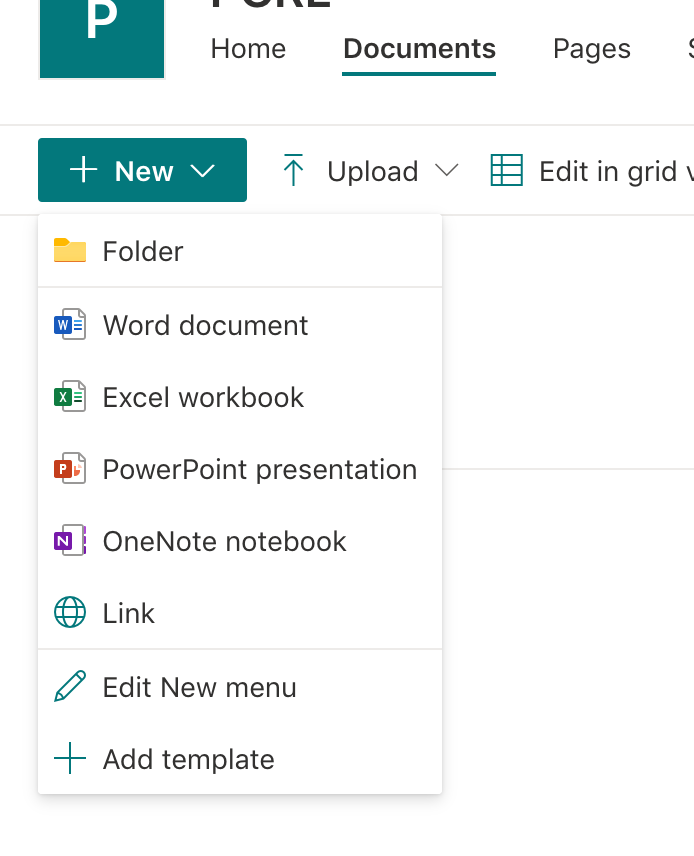

# How to generate load against proxied Sharepoint site ?

This section assumes basic Load Test framework setup is done using the instructions below:

For Azure AKS - ["Provision an AKS Cluster"](../deployment/terraform/aks/README.MD)<br/>
For AWS EKS see ["Provision an EKS Cluster"](../deployment/terraform/eks/README.md)

Sharepoint site load testing script requires:
- Sharepoint API key setup to be able to upload and download files.
- Folder called "pcre" created in some sample site documents page in Sharepoint.


## How to setup Sharepoint API Key?

These settings needs to be done by someone who has **full admin** permissions to the sharepoint site:

**Step 1 Register an App**

Navigate to https://[TENANT -NAME].sharepoint.com/_layouts/15/appregnew.aspx

    Open notepad
    Click Generate next to Client ID
    Copy the generated Client ID
    In notepad, replace the bold GENERATED CLIENT ID text with the copied generated client id
    Click Generate next to Client Secret
    Copy the generated Client Secret
    In notepad, replace the bold GENERATED CLIENT SECRET text with the copied generated client secret
    Update App Domain with google.com
    Update Redirect URL with https://localhost/
    Click Create

 **Step 2 Grant APP-Only permission to the APP**

- Navigate to https://[TENANT-NAME].sharepoint.com/_layouts/15/appinv.aspx

Note: Client Id generated during APP registration appended with an @, followed by the Tenant ID

- Paste the value of “Client Id:” from the notepad in the App Id field
- Click Lookup
- Update the Permission Request XML: field the below values:
```bash
\<AppPermissionRequests AllowAppOnlyPolicy="true"\>\<AppPermissionRequest
Scope="http://sharepoint/content/sitecollection/web"
Right="Write"\/\>\<\/AppPermissionRequests\>
```
- Click Create

The following links have information regarding recommended practices with respect to security and best practices: 
https://docs.microsoft.com/en-us/sharepoint/dev/sp-add-ins/add-in-permissions-in-sharepoint

https://docs.microsoft.com/en-us/sharepoint/dev/solution-guidance/security-apponly-azureacs 

**Step3. Enable Grant App Permission**

For new SharePoint subscription Grant App Permission is disabled by default or the browser link https://xxxx-admin.sharepoint.com/_layouts/15/appinv.aspx is disabled. 

To enable this feature, we need to connect to SharePoint using Windows PowerShell and then run set-spotenant -DisableCustomAppAuthentication $false.

Run the following commands on PowerShell:

```bash
Install-Module -Name Microsoft.Online.SharePoint.PowerShell
$adminUPN="<the full email address of a SharePoint administrator account, example: jdoe@contosotoycompany.onmicrosoft.com>"
$orgName="<name of your Office 365 organization, example: contosotoycompany>"
$userCredential = Get-Credential -UserName $adminUPN -Message "Type the password."
Connect-SPOService -Url https://$orgName-admin.sharepoint.com -Credential $userCredential
set-spotenant -DisableCustomAppAuthentication $false
```
## Create folder name "pcre"

Click on documents and create new folder named "pcre". files will be upload to this folder.



## Modify Sharepoint related parameters in config.env file

The Sharepoint Load Script needs to know tenant id, client id and secret key to successfully upload and download files.

Once these parameters are created then they need to be put in the framework config.env file.

In EC2 virtual machine created via provided AMI, the following manual configurations needed to be done:

- Go to scripts folder and open config.env file for editing:

```bash
sudo nano ~/p-k8-jmeter-test-engine/jmeter-icap/scripts/config.env
```
 Modify the following parameters:

- TENANT_ID : same as what is created above.
- CLIENT_ID: same as what is created above
- CLIENT_SECRET: same as what is created above.

save the file and restart the following service:

```bash
sudo systemctl stop flask_scaled 
sudo systemctl start flask_scaled
sudo systemctl status flask_scaled
```
Above modifications are specific to sharepoint, see ["How to generate Scaled Load Via UI"](./How-to-generate-Scaled-Load-via-UI.md) this to ensure that other generic paremeters are also modified, if they are not already done. 

## How to run load against Sharepoint end point?

Load generation can be triggered via provided UI interface.

UI interface looks like this and accessible via http://give-virtual-machine-ip


The Load Generator UI form has the following options:

- Total Users: 
    - How many total concurrent requests would you like to send? Default: 25
    - Maximum number of total users depends on the Virtual Machine resources:

| vCPU     | RAM | Total Users    | 
| :----:   | :----:   |    :----: |
| 2-4      | 2-4 GB     | 50-100   |
| 4-6  | 6-8  GB      | 100-200| 
| 8+ | 8+  GB      | 400| 

- Rampup time: How fast you would like to ramp up total users? Default is 300.
- Duration: How long would you like to generate load? Default is 900
- Load Type: Select Sharepoint as load type
- SharePoint Endpoint URL name: without http/https. Example: mysite.sharepoint.com
- SharePoint Proxy IP and Hostnames*: This is needed in order to modify hosts file in LoadGenerators so that traffic goes via proxy. 
- Port: If http then port should be 80, if https then port should be 443. Default is 443.
- Prefix: prefix is used to distinquish different dashboards and measurements. For different kind of load scenarios it is good to use their own prefix so that dashboard view would be unique for that specific scenario

## How to generate load?

Load generation process is simple:

- Ensure that target application under test is up and running
- Open browser and access Load Generation UI http://virtual-machine-ip
- Enter load scenarios based on above description
- Click on Generate Load
- Dashboard link will be shown in the page


if you would like to stop the test, just click on "Stop Load" button.

## How to use performance dashboard?

After you click Generate Load button, dashboard link for that specific prefix will be shown in the page.

Click that link and it will open dashboard login page:


Enter admin/glasswall and then dashboard ui will be visible with your own prefix:


